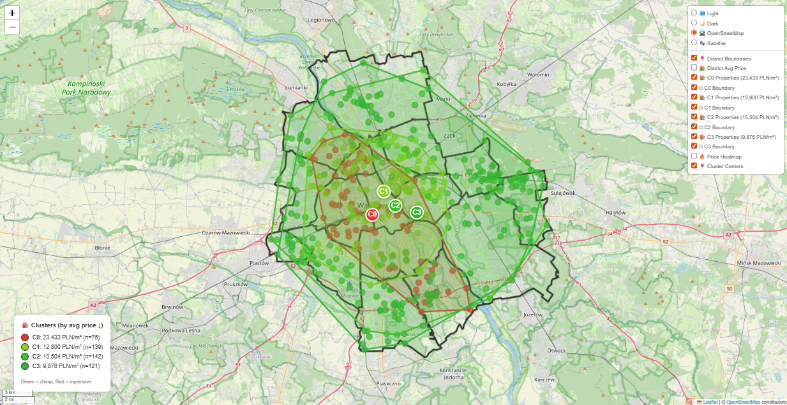
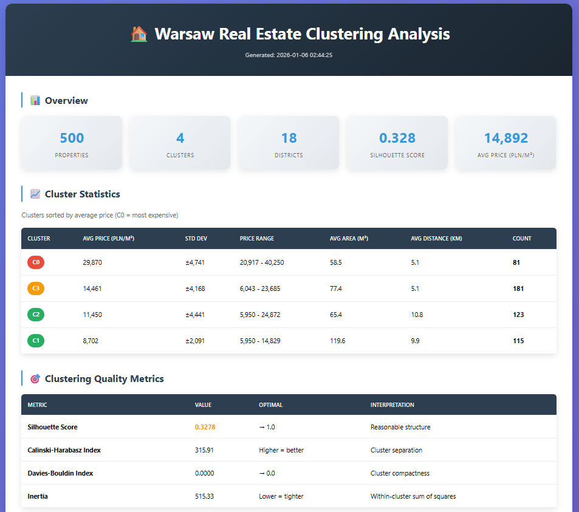
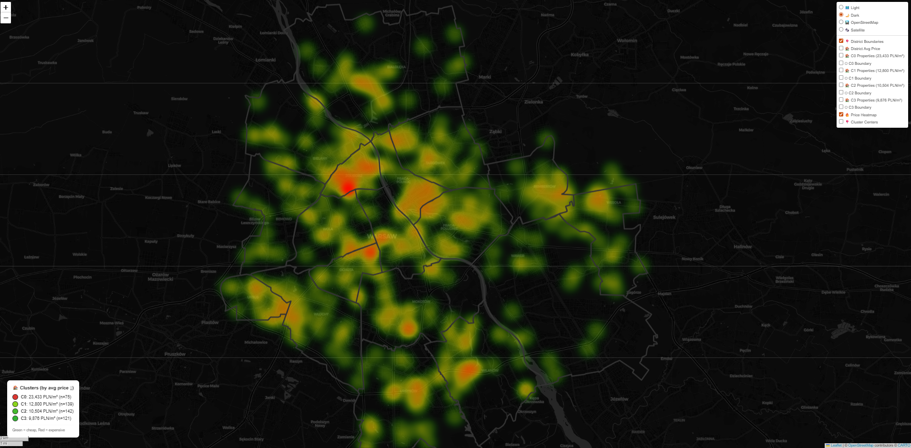
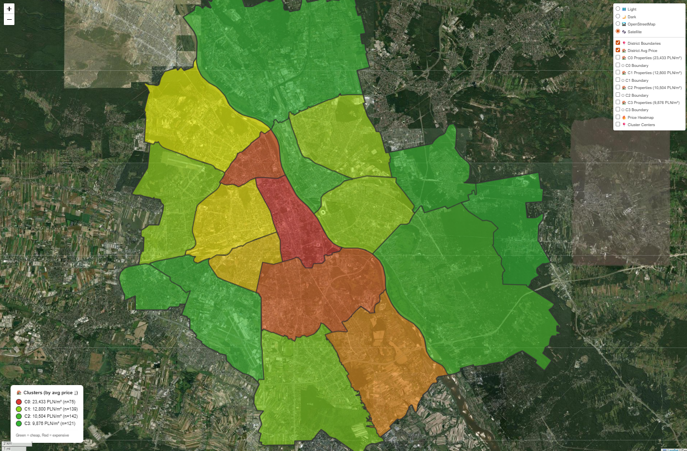
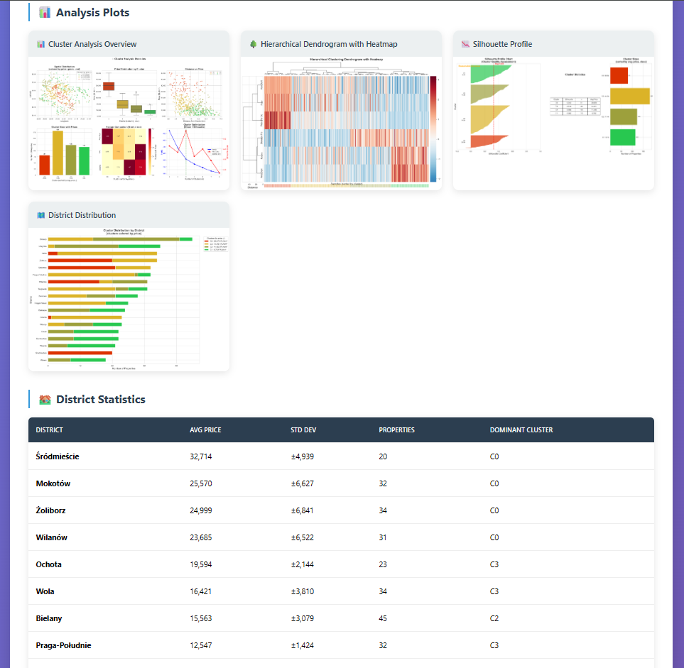

# 🏠 Warsaw Real Estate Clustering Analysis

> Advanced geospatial clustering analysis of Warsaw's real estate market using authentic district boundaries from OpenStreetMap

[](https://www.python.org/)
[](https://opensource.org/licenses/MIT)
[](https://geopandas.org/)
[](https://github.com/psf/black)
[](https://github.com/JakubPatkowski/WarsawRealEstateClustering/releases)
[](https://github.com/JakubPatkowski/WarsawRealEstateClustering/actions)




## 🎯 Overview

This project performs sophisticated clustering analysis on Warsaw's real estate market using authentic district boundaries from OpenStreetMap. Unlike typical approaches that use approximated circular boundaries, this implementation generates synthetic real estate data **inside actual district polygons**, providing highly realistic spatial analysis.

### Key Innovation
✨ **Authentic District Boundaries**: Uses OpenStreetMap data with manual stitching algorithm to create precise 18-district polygons of Warsaw

## ✨ Features

### 🗺️ Geospatial Analysis
- **Real district boundaries** from OpenStreetMap (Manual Stitching algorithm)
- **Synthetic data generation** inside actual polygons (validated with `polygon.contains()`)
- **18 Warsaw districts** with precise administrative boundaries

### 📊 Clustering Algorithms
- **K-means** with automatic k optimization (Silhouette + Elbow method)
- **DBSCAN** for comparison (optional)
- **Automated k selection** based on clustering quality metrics

### 📈 Interactive Visualization
- **Folium interactive maps** with multiple toggleable layers:
  - ✅ Real district boundaries
  - 📍 Property points per cluster
  - 🔷 Cluster boundaries (convex hull)
  - 🔥 Price heatmap
  - 📍 Cluster centroids
  - 🌓 Light/Dark theme

### 💼 Market Segmentation
Four real estate market segments:
- **Premium** (15%): 22,000-35,000 PLN/m²
- **Upper** (25%): 16,000-22,000 PLN/m²
- **Standard** (35%): 11,000-16,000 PLN/m²
- **Economy** (25%): 7,000-12,000 PLN/m²

## 🚀 Quick Start

### Prerequisites

- Python 3.9 or higher
- pip or uv (recommended)

### Installation

```bash
# 1. Clone the repository
git clone https://github.com/JakubPatkowski/WarsawRealEstateClustering.git
cd WarsawRealEstateClustering

# 2. Install dependencies
# Using pip
pip install -r requirements.txt

# Or using uv (faster)
uv pip install -r requirements.txt

# Activate venv
.\.venv\Scripts\activate 

# 3. Run the analysis
python main.py -v
```

### First Run

On first execution, the application will:
1. Fetch authentic district boundaries from OpenStreetMap
2. Cache them in `data/boundaries/districts_cache.geojson`
3. Generate synthetic real estate data
4. Perform clustering analysis
5. Create interactive visualization

## 📋 Usage Options

```bash
# Verbose mode with detailed output
python main.py -v

# Debug mode with extensive logging
python main.py -d

# Force specific number of clusters
python main.py --k 5

# Use extended features (area, year, floor)
python main.py --extended-features

# Compare K-means with DBSCAN
python main.py --compare-dbscan

# Force refresh district boundaries from OpenStreetMap
python main.py --force-refresh

# Generate more properties (default: 500)
python main.py --n-samples 1000

# Combine options
python main.py -v --k 6 --n-samples 2000
```

## 📁 Project Structure

```
warsaw_real_estate_clustering/
├── config/
│   ├── settings.py                 # Central configuration
│   └── logging_config.py           # Logger setup
│
├── src/
│   │
│   ├── analysis/
│   │   ├── clustering.py           # K-means, DBSCAN
│   │   ├── optimizer.py            # Automatic k selection
│   │   └── statistics.py           # Statistical analysis
│   │
│   ├── boundaries/                 # District boundary fetching
│   │   └── district_fetcher.py     # OpenStreetMap integration
│   │
│   ├── data_collection/
│   │   └── synthetic_generator.py  # Generates points inside polygons
│   │
│   ├── data_processing/
│   │   ├── cleaner.py              # Data cleaning and validation
│   │   └── transformer.py          #Transform and scale features for clustering.
│   │
│   └── visualization/
│       ├── map_creator.py          # Interactive Folium maps
│       ├── plot.py                 # Static visualizations
│       └── report.py               # HTML reports
│
├── data/
│   ├── raw/                        # Raw data
│   ├── processed/                  # Processed datasets
│   └── boundaries/                 # District boundary cache
│
├── output/
│   ├── maps/                       # HTML interactive maps
│   ├── plots/                      # Static visualizations
│   └── reports/                    # Analysis reports
│
├── main.py                         # Application entry point
├── requirements.txt                # Dependencies (pip)
├── pyproject.toml                  # Project metadata (uv/poetry)
├── uv.lock                         # Locked dependencies (uv)
└── README.md
```

## 🎨 Output Files

After running the analysis, you'll find:

| File | Description |
|------|-------------|
| `outputs/maps/cluster_map.html` | Interactive Folium map with all layers |
| `data/processed/properties_clustered.csv` | Dataset with cluster assignments |
| `data/boundaries/districts_cache.geojson` | Cached district boundaries |
| `outputs/plots/elbow_curve.png` | Elbow method visualization |
| `outputs/plots/silhouette_scores.png` | Silhouette score comparison |

## 🗺️ Interactive Map Layers

The generated map includes toggleable layers:

1. **📍 District Boundaries** - Authentic 18 Warsaw districts from OpenStreetMap
2. **🔷 Cluster Boundaries** - Convex hull per cluster
3. **🏠 Properties** - Individual property points, color-coded by cluster
4. **🔥 Price Heatmap** - Gradient visualization of price distribution
5. **📍 Cluster Centers** - K-means centroids
6. **🌓 Theme Toggle** - Light/Dark basemap

### Example Map Screenshot




### Example Report Screenshot




## ⚙️ Configuration

Main configuration in `config/settings.py`:

```python
# K-means optimization range
k_range = (3, 10)

# Features for clustering
feature_columns = [
    "price_per_sqm", 
    "area_sqm", 
    "distance_from_center_km"
]

# Extended features (optional)
extended_features = [
    "price_per_sqm", 
    "area_sqm", 
    "distance_from_center_km",
    "year_built", 
    "floor"
]

# Number of properties to generate
n_samples = 500
```

## 🔧 Technology Stack

### Core Libraries
- **Python** 3.9+
- **Shapely** - Geometric operations
- **GeoPandas** - Geospatial data manipulation
- **Scikit-learn** - Clustering algorithms (K-means, DBSCAN)
- **Folium** - Interactive maps
- **NumPy** & **Pandas** - Data processing

### External Services
- **Overpass API** - OpenStreetMap data retrieval

## 📊 Market Segments

The analysis divides Warsaw's market into 4 segments:

| Segment | Share | Price Range (PLN/m²) | Key Districts |
|---------|-------|----------------------|---------------|
| **Premium** | 15% | 22,000-35,000 | Śródmieście, Mokotów, Żoliborz, Wilanów |
| **Upper** | 25% | 16,000-22,000 | Mokotów, Ochota, Wola, Bielany |
| **Standard** | 35% | 11,000-16,000 | Wola, Praga-Południe, Ursynów, Bemowo |
| **Economy** | 25% | 7,000-12,000 | Białołęka, Targówek, Wawer, Rembertów |

## 🔬 Algorithm Details

### District Boundary Fetching
1. **Overpass API Query** - Fetch administrative boundaries for Warsaw
2. **Manual Stitching** - Custom algorithm to connect incomplete polygon segments
3. **EPSG:32634 Projection** - UTM 34N for accurate area calculations
4. **Validation** - Ensures all 18 districts are properly formed

### Synthetic Data Generation
1. **Polygon-based sampling** - Generate random points inside district boundaries
2. **Validation** - `polygon.contains(point)` ensures authentic locations
3. **Realistic distributions** - Price, area, year based on district characteristics
4. **Market segmentation** - Properties assigned to Premium/Upper/Standard/Economy

### Clustering Optimization
1. **Silhouette analysis** - Measures cluster separation quality
2. **Elbow method** - Identifies optimal k by inertia curve
3. **Combined scoring** - Balances both metrics for best k selection

## ⚠️ Important Notes

1. **🔒 Do NOT modify** `stitch_line_segments()` algorithm - it works perfectly
2. **💾 Boundary cache** - Districts fetched once, stored in `data/boundaries/`
3. **🌍 EPSG:32634** - Used for area calculations (UTM 34N for Poland)
4. **✅ Point validation** - All points verified with `polygon.contains(point)`

## 📝 License

This project is licensed under the MIT License - see the [LICENSE](LICENCE) file for details.

## 👨‍💻 Author

**Jakub Patkowski**
- GitHub: [@JakubPatkowski](https://github.com/JakubPatkowski)
- LinkedIn: [jakub-patkowski](https://www.linkedin.com/in/jakub-patkowski-613565346/)

## 🎓 Academic Context

This project was developed as part of the **Advanced Data Exploration** course, demonstrating:
- Geospatial data manipulation
- Unsupervised machine learning
- Real-world data synthesis
- Interactive visualization techniques

## 🙏 Acknowledgments

- Warsaw administrative boundaries from [OpenStreetMap](https://www.openstreetmap.org/)
- Inspired by real estate market analysis methodologies
- Built for educational purposes

## 📚 Further Reading

- [K-means Clustering](https://scikit-learn.org/stable/modules/clustering.html#k-means)
- [GeoPandas Documentation](https://geopandas.org/)
- [Folium Documentation](https://python-visualization.github.io/folium/)
- [OpenStreetMap Overpass API](https://wiki.openstreetmap.org/wiki/Overpass_API)

---

⭐ **If you find this project useful, please consider giving it a star!**